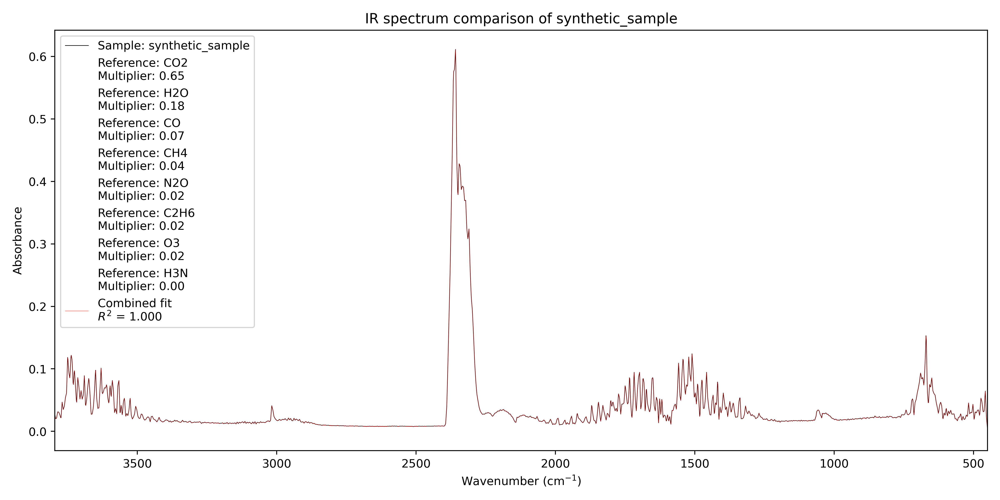
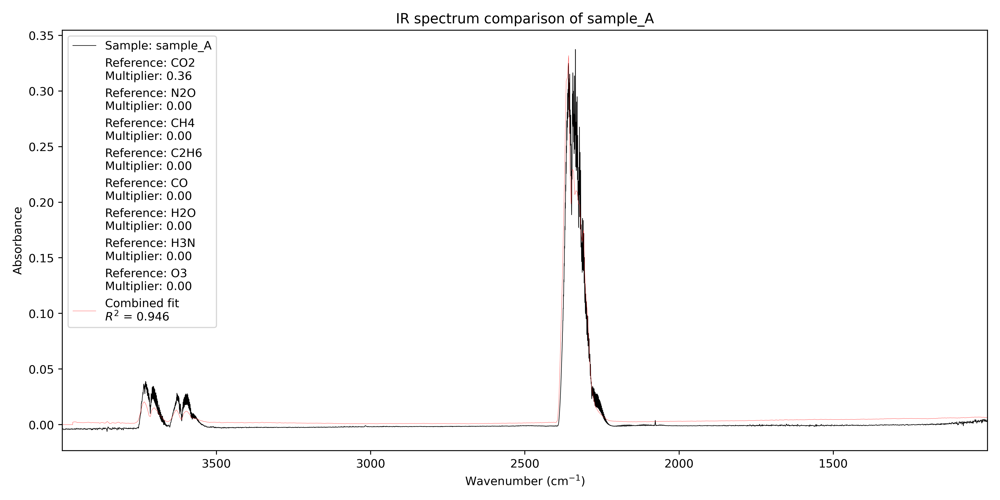
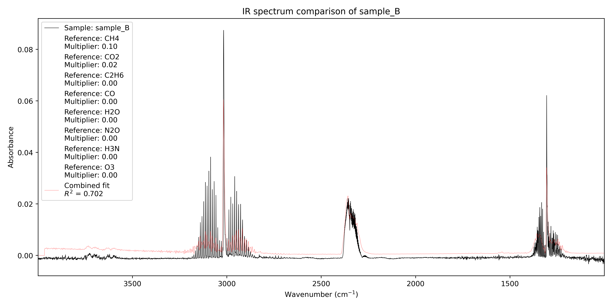
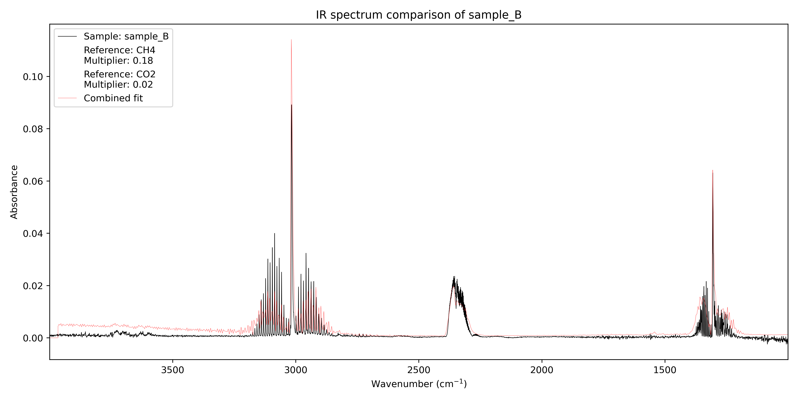

# Spectral Matching Tool

A lightweight IR spectral fitting and visualization toolkit.

## Introduction 
A lightweight Python tool for analyzing infrared spectra.


This tool was created as a personal project but can be used for educational and simple research use (e.g., gas mixture analysis, laboratory exercises, atmospheric composition demonstrations).

### Features

- Loading and handling reference and sample spectra (CSV or JCAMP-DX).

- Convert transmittance ↔ absorbance automatically.

- Linear baseline correction with configurable window.

- Automatic alignment/interpolation of reference spectra to sample.

- Least-squares fitting to determine optimal reference multipliers.

- Plotting of:

  - Spectra in JCAMP-DX or CSV formats

  - The fitted model

  - Individual constituent fits

  - Residuals 

- Basic command-line interface.

## Installation
```
git clone https://github.com/DHANDLE/spectral-matching-tool
cd spectral-matching-tool
pip install -r requirements.txt
```
The project does not provide any reference spectra, but to get up and running a selection of reference spectra can be downloaded from NIST via:
```
python3 scripts/download_references.py
```
This downloads spectra for $`NH_3, H_2O, CO, N_2O, O_3, C_2H_6, CH_4`$ and $`CO_2`$.
These reference spectra were used in the examples below, but to get the best results, references should be obtained from the same apparatus as the sample.
## Usage
### Default Behavior
Running the tool without arguments analyzes all samples in the folder specified by `config.py`, by default `data/referece/`:
```
python3 main.py
```
### List available reference spectra
Prints a list of all references found in in the folder specified by `config.py`, by default `data/referece/`:
```
python3 main.py list-refs
```

### Plot a spectrum file
This will display the raw spectrum without fitting.
```
python3 main.py plot path/to/spectrum.csv
python3 main.py plot sample1.csv sample2.jdx
```

### Analyze a specific sample
This runs the full fitting routine using the configuration in `config.py`.
```
python3 main.py analyze path/to/sample.csv
```

## Configuration
All analysis behavior is controlled via `config.py. For example:
- Baseline correction settings
- Clamping of negative absorbance values
- Whether constituent fits or residuals are shown
- Manually specifying the fitting references and multipliers 
- Explicit reference multipliers
- Which subset of references to use
- File paths
- Plotting options

Every option is documented in the config file itself.

## Data Format
The spectral matching tool can load spectra either in the `JCAMP-DX` format or as `CSV` files.
The current version expects references to be in `JCAMP-DX` and the samples can be in either format. 

The `CSV` files may contain any number of header fields and\
wavenumber (in $`cm^{-1}`$), absorbance pairs:
```
wavenumber , absorbance
3999.88 , 0.0025
3999.76 , 0.0024
...
```

## Examples
### Synthetic Example
This sample was generated using: 
```
python3 scripts/gen_synthetic_sample.py
```


### Sample A
This example shows automatic fitting and identification of constituents of a real sample.
The sample spectrum is provided with the tool.


### Sample B
In this provided sample the tool was able to correctly predict the constituents but with $`R^2=0.702`$. In this example this was due to the sample and the reference not having been recorded under the same conditions.

However manual fitting can be used in many cases to get a better fit and estimate.


## Interpretation of Fitted Multipliers
The least-squares fitting in this tool models the sample absorbance spectrum $\mathbf{S}$ as a linear combination of the reference spectra $\mathbf{r}_1$, each scaled by their corresponding multiplier $m_1$:

$$
\mathbf{S} = \sum_i m_i \mathbf{r}_i
$$

The least-squares multipliers produced by the tool hence represent relative scaling factors, not direct gas abundances. 
To interpret the multipliers physically (e.g., to derive gas abundances), the Beer-Lambert law can be applied.
However, this requires additional experimental information about both the sample and the reference measurements, such as the instrument setup, measurement conditions, and calibration parameters.

## Disclaimer
This tool is intended for educational and research use.
Do not use the results for safety-critical or industrial decision-making without proper validation.
